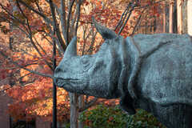
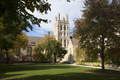

# recover

This is the CS50 recover problem set 4.

## Goals

The goal of this project is to recover some JPEG images from the "memory card" (card.raw file) using the C language. In this [problem set page](https://cs50.harvard.edu/x/2022/psets/4/recover/) the Harvard team created a context of someone who spent the few days taking photos and, accidentally, deleted all of them from the camera's memory card. So they explain what I'll need to do in order to recover those photos.

## What I did

Here, instead of giving me some distribution code to start programming, the staff team just gave me the card.raw file and the recover.c with the libraries and main function. So, everything that's written in the recover.c file was made by me.

I started this project by thinking in which functions should I use in order to solve this problem. Than I concluded that it would be usefull to have a function that detects whether or not I'm at the beginning of a JPEG - so I can tell if I'm finnished reading/writing it - and have a function that seeks the "memory card" for more photos. Those are, respectively, `is_jpeg` and `recover_jpeg` functions.

### is_jpeg

This function reads the first 512 bytes of the "memory card" in order to check if the first four bytes belongs to a JPEG. Since JPEG has a "byte signature" in its first four bytes, it's easy to check if I've read a "JPEG header" or not. If this function doesn't find all the four bytes in order, it checks if has reached EOF and returns 2 if did, or 0 if not.

### recover_jpeg

This function is responsable for doing all the hard work of reading and writing data. It firstly creates a local buffer (`JPEG_BLOCK`) and guarantees that it started reading a JPEG. Than it declares a `filename` string, responsable to store the formated name of the images, so I don't need to name each file individually. Finally, it loops over the whole "memory card" reading and writing the images to the new files it created, until it reaches EOF.

Here are some of the photos I've recovered

NOTE: The photos are small so in the program execution I don't waste too much time to read/write one photo.

If you wish to see all the examples, please click on the JPGs folder and select the image you wold like to see and than click on \"view raw".

I hope you enjoyed the project as much as I did.